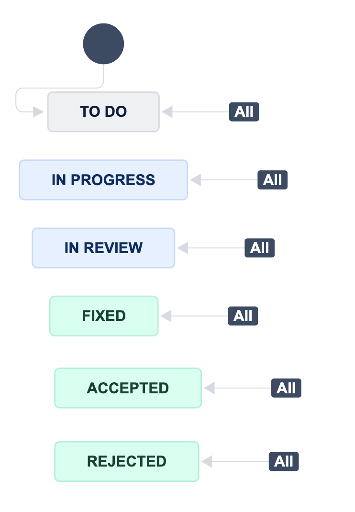

# Snyk Ignore

## What is this?
Currently, customers can [ignore](https://docs.snyk.io/scan-using-snyk/find-and-manage-priority-issues/ignore-issues) a Snyk issue via the Web UI. However, security teams at larger enterprises might not always want their developers to do this without first stating a valid reason. Ideally, Snyk would allow developers to first "request an ignore" and enable the security team to review it before accepting or rejecting it. This tool facilitates such a process with the help of JIRA:
1. Developers may prompt the security team to ignore an issue by creating a JIRA ticket via Snyk's [JIRA integration](https://docs.snyk.io/integrate-with-snyk/notification-and-ticketing-systems-integrations/jira-integration). (Note that in this scenario only the security team should have the permission to ignore issues, which can be enforced via [Member Roles](https://docs.snyk.io/snyk-admin/manage-permissions-and-roles/manage-member-roles)).
2. A discussion can then take place within the JIRA ticket during which developers may present their arguments in support of the requested ignore.
3. If the security team agrees or disagrees, they will transition the ticket's state to `Accepted` or `Rejected`, respectively.
4. The team will then run the `sync` subcommand, which will automatically apply those ignores that have been approved (inserting the reasons stated in the ticket as ignore comments).
5. Optionally, the team can generate an Html report via the `--report` flag, which will list the outstanding tickets to be reviewed, as well as the approved ones. Apart from being a worklist, the report may also satisfy some of the customer's compliance obligations.

## Requirements

* Python 3.11 (An older version will likely work as well, but the script was tested with this version)
* A [Snyk API token](https://docs.snyk.io/getting-started/how-to-obtain-and-authenticate-with-your-snyk-api-token) with the necessary permissions to list issues and apply ignores.
* A JIRA user name (usually an email!) and API token
* A JIRA project set up to work with [Snyk's JIRA integration](https://docs.snyk.io/integrate-with-snyk/notification-and-ticketing-systems-integrations/jira-integration).
* The project must have a [JIRA workflow](https://www.atlassian.com/software/jira/guides/workflows/overview#what-is-a-jira-workflow) with the following states (Other workflows are possible, but they will require minor changes in the tool):

